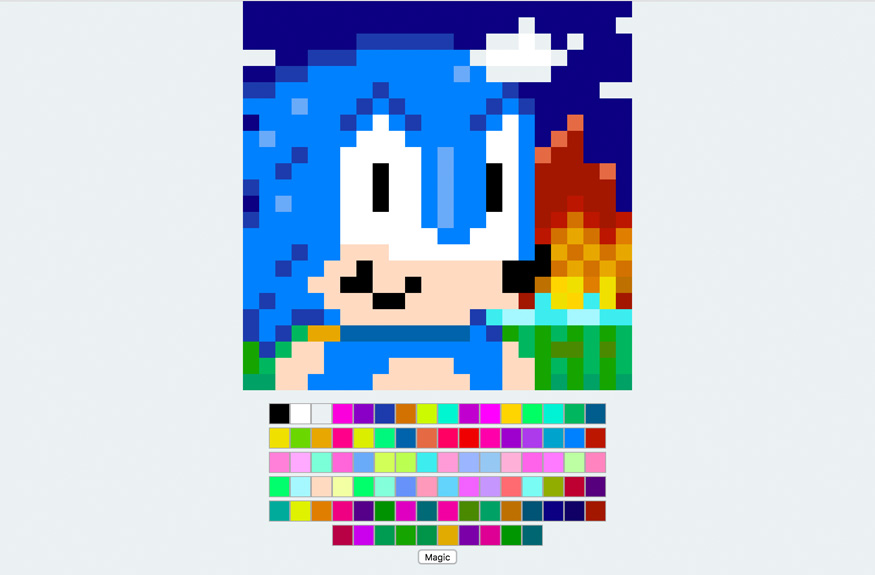
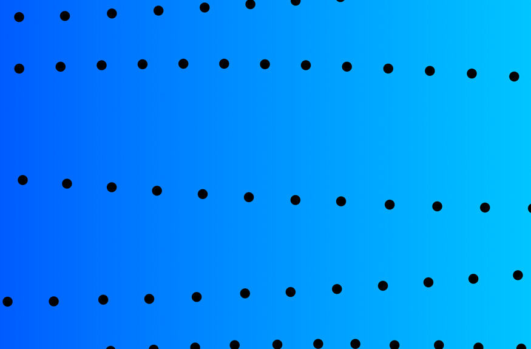
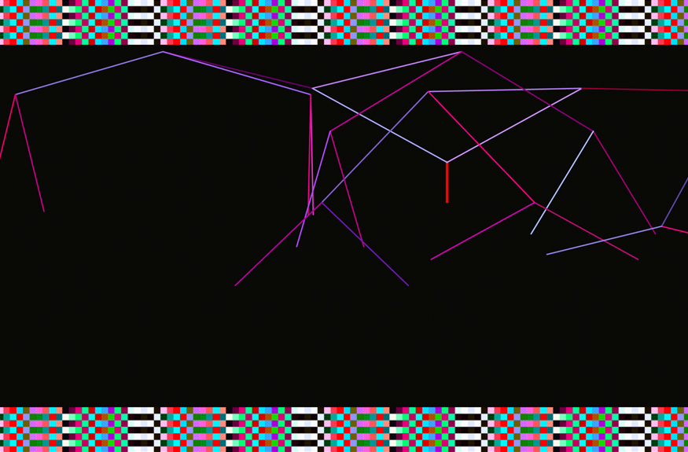

<pre>
███████╗
╚════██║
    ██╔╝                a collecton of frontend web
   ██╔╝                  projects by Michael Matyi
   ██║  
   ╚═╝
</pre>

## Overview
This repository contains various small frontend web projects by [yours truly](http://matyi.net). While these projects were done on a whim and are not actively maintained, they might interest you if you're curious about my work.

You can quickly install dependencies for and build all projects using the `./setup_all.sh` script in the main directory.

## `/cart`

This is a simple storefront written in [TypeScript](https://github.com/Microsoft/TypeScript) that uses raw HTML for templates and depends on no external libraries. A [Sinatra](https://github.com/sinatra/sinatra) server allows catalogue data to be loaded from JSON.

Make sure you have Ruby `2.1.2` installed and run the `build.sh` script in this directory. Then cd to the `server` directory and run `./server.rb`. The page can be viewed at [localhost:7772](http://localhost:7772).

## `/clock`

This is digital clock written in JavaScript and using [Moment](https://github.com/moment/moment) and [Underscore](https://github.com/jashkenas/underscore). The background cycles through various images that differ depending on the time of day. Various milestones throughout computing history are randomly displayed under the time.

Simply `npm install` and open `index.html` in your web browser.

## `/pixel`

This is a pixel editor written in JavaScript with [React](https://github.com/facebook/react). Not as cool as [the work of jennmoneydollars](https://github.com/jennschiffer/make8bitart).

Just run `npm install` and `npm run build`, then open `index.html` in your web browser.

## `/stardust`

This was an attempt to write the worst, most unreadable yet still syntactically valid JavaScript possible. Stars and colors pulse in and out of existence like a gaudy screensaver from the mid-90s.

To view, open `index.html` in your web browser.

## `/todo`

Yet another to-do list in [Angular](https://github.com/angular/angular) (1.3) and [Bootstrap](https://github.com/twbs/bootstrap), although built from scratch rather than going off the one that everyone has seen on the Internet.

Simply run `npm install` and `npm run build`, then open `index.html` in your web browser.

## `/waves`

A weird particle waves animation using a small amount of JavaScript and CSS keyframes.

To view, open `index.html` in your web browser.

## `/wtf`

A psychedelic animation with growing, colorful lines written in [CoffeeScript](https://github.com/jashkenas/coffeescript) and using [D3](https://github.com/mbostock/d3). Changes from light to dark periodically.

Run `npm install` and `npm run build`, then open `index.html` in your web browser.

## License
MIT